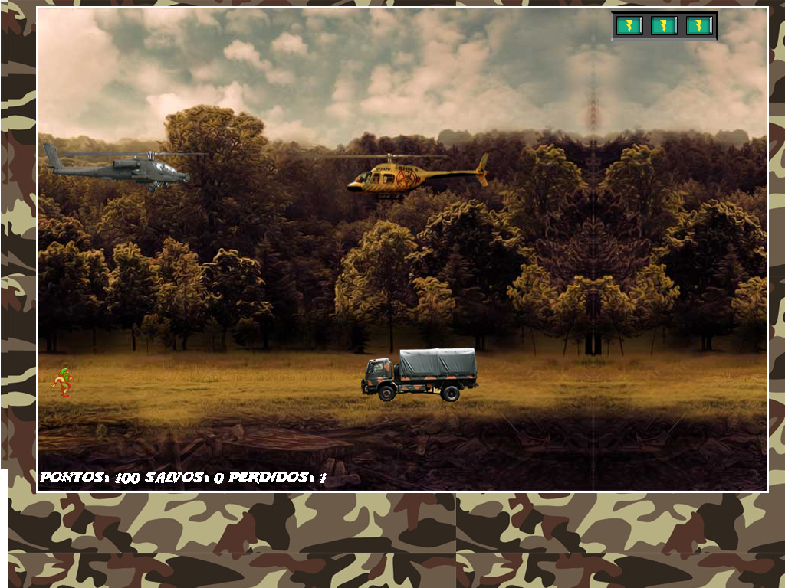
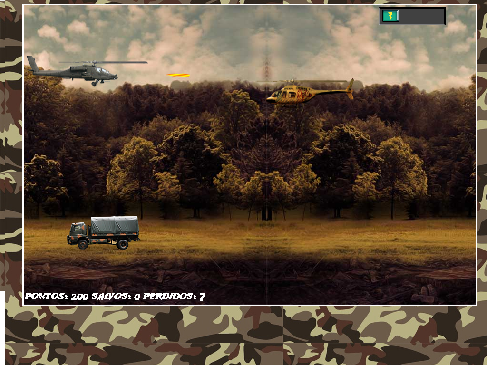
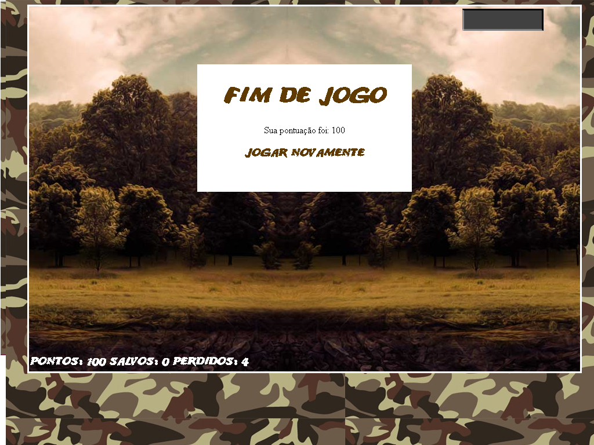

# Resgate_DIO
Resultado do curso "Construindo o seu primeiro jogo de naves", ministrado por [Denilson Bonatti] na plataforma [Digital Innovation One](https://digitalinnovation.one/ "Digital Innovation One"). 

### Descrição
"Uma das dificuldades dos desenvolvedores de jogos é encontrar uma plataforma de desenvolvimento compatível com os diversos dispositivos móveis no mercado e também com os diferentes navegadores (browsers). Utilizando o HTML5 juntamente com as folhas de estilo CSS3 e o JavaScript, é possível desenvolver jogos de forma rápida e compatível com diversas plataformas, incluindo dispositivos móveis. No projeto são discutidas as etapas de desenvolvimento de jogos em HTML5, CSS3 e JavaScript do início ao fim, utilizando a didática passo a passo em seu desenvolvimento. Neste projeto, especificamente, os jogos serão publicados de forma que possam ser acessados via browser."
## Como jogar
Para iniciar o jogo basta executar o arquivo index.html em um navegador de internet a partir de uma cópia do repositório em um diretório local.
### Controles
| Comando                            |  Tecla |
|------------------------------------|:------:|
| Mover helicóptero para cima        |   "W"  |
| Disparar míssil                    |   "D"  |
| Mover helicoptero para baixo       |   "A"  |

### Resultado

